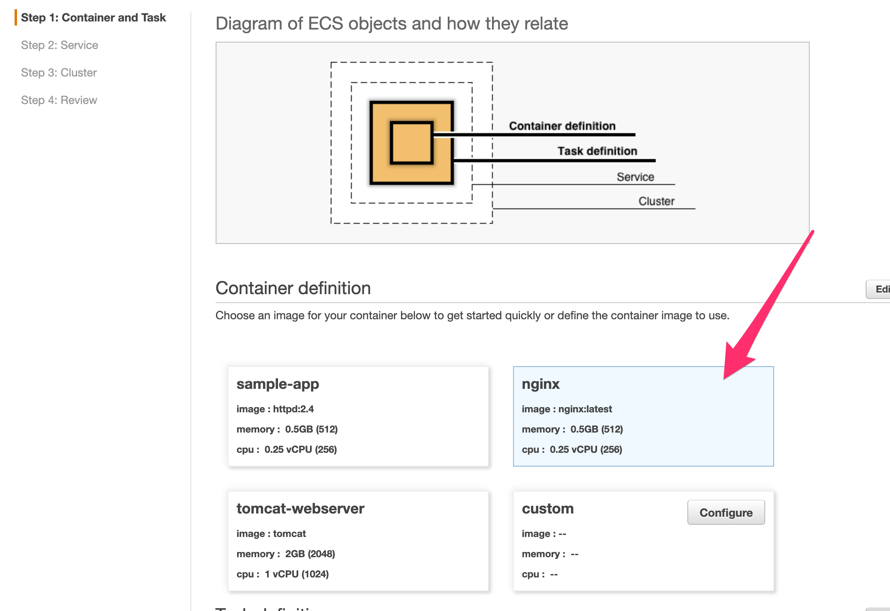
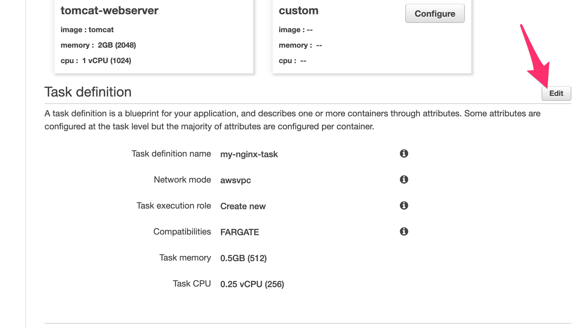
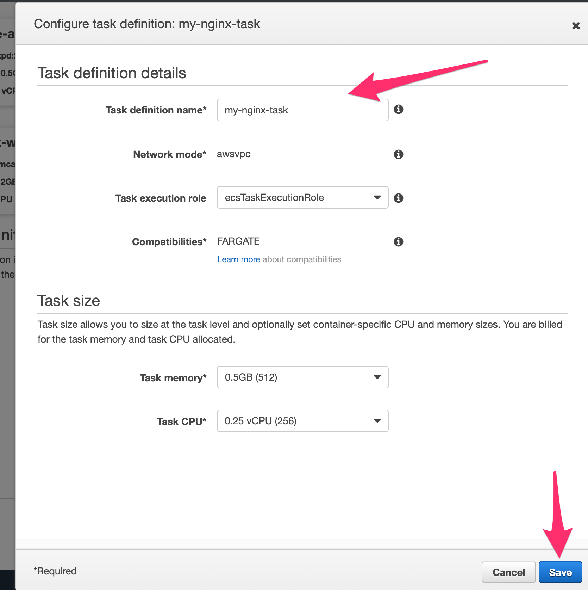

# Create Container and Task

> [!TIP]
> This wizard will guide you thru the creation of a Container, Task, Service and Cluster in a easy way. Every piece of it is fully customizable via command line.

## 1. Go to the ECS console

<!-- tabs:start -->
#### ** Virginia USA**
Create a Cloud9 Environment using the console https://console.aws.amazon.com/ecs/home?region=us-east-1#/getStarted
#### ** Ireland **
Create a Cloud9 Environment using the console https://eu-west-1.console.aws.amazon.com/ecs/home?region=eu-west-1#/getStarted
<!-- tabs:end -->

## 2. Getting started with ECS using Fargate

* Press ``Get Started`` button in the main page
* Once in the **Step 1: Container and Task** select the ``nginx`` option as shown below.

* Scroll down and select ``Edit`` to edit the particular properties of this task.
  

* Just change the name of this task to ``my-nginx-task`` and press ``Save``
  

* Press ``Next`` to now create the service.
