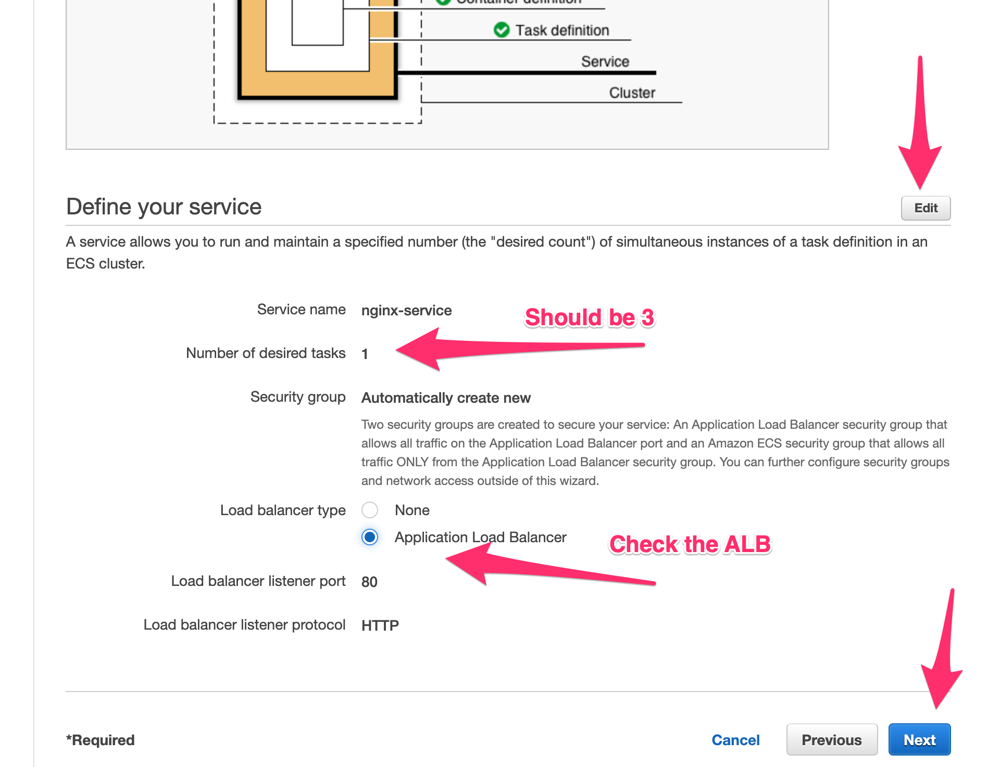

# Create Service

## 1. Modify the Service

Remember that a service might want to have N number of tasks executing at a certain time. We will modify that desired number and add an Application Load Balancer in front of it to balancer the load to the different NGINX containers running.

* Press ``Edit`` and modify the desired number of tasks to ``3``
* Select the **Load balancer type** to ``Application Load Balancer``
* Press ``Next``

