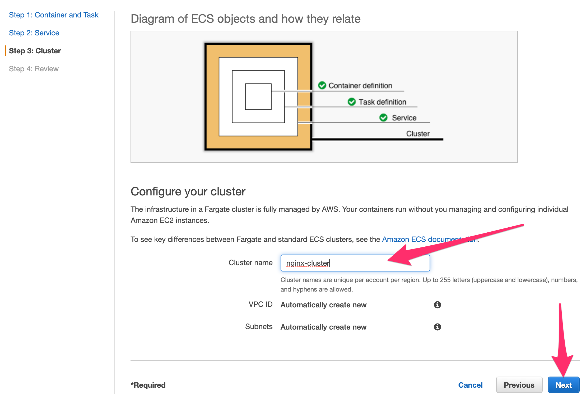
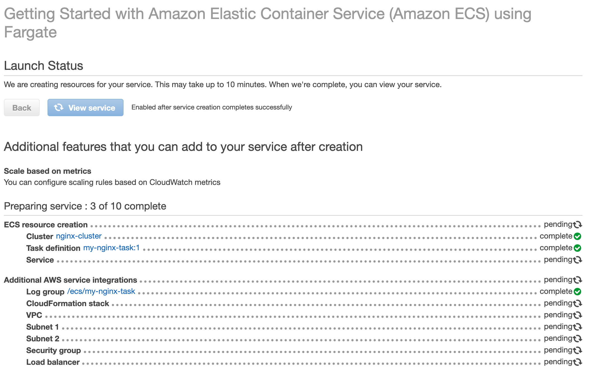

# Create Cluster

## 1. Name Your Cluster

* Change the name of the cluster to ``nginx-cluster`` and press ``Next``

* In the next page you will just press ``Create``. 
* A screen that shows the status of the deployment will show up. This might be a good moment for a 5 min bio break or :coffee:

