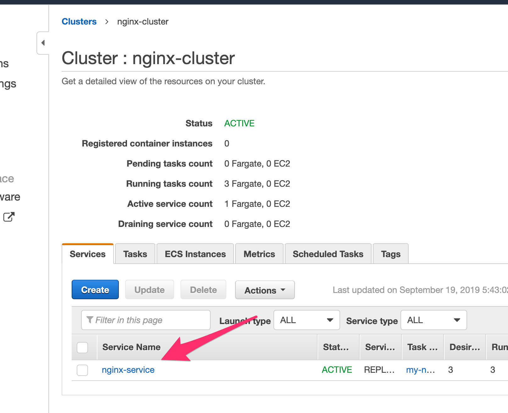
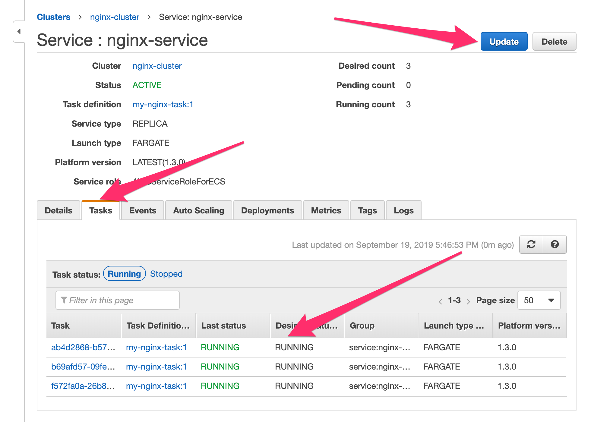
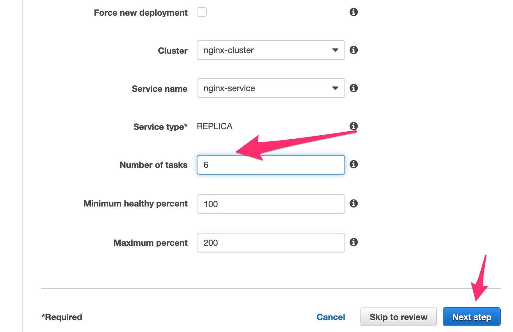
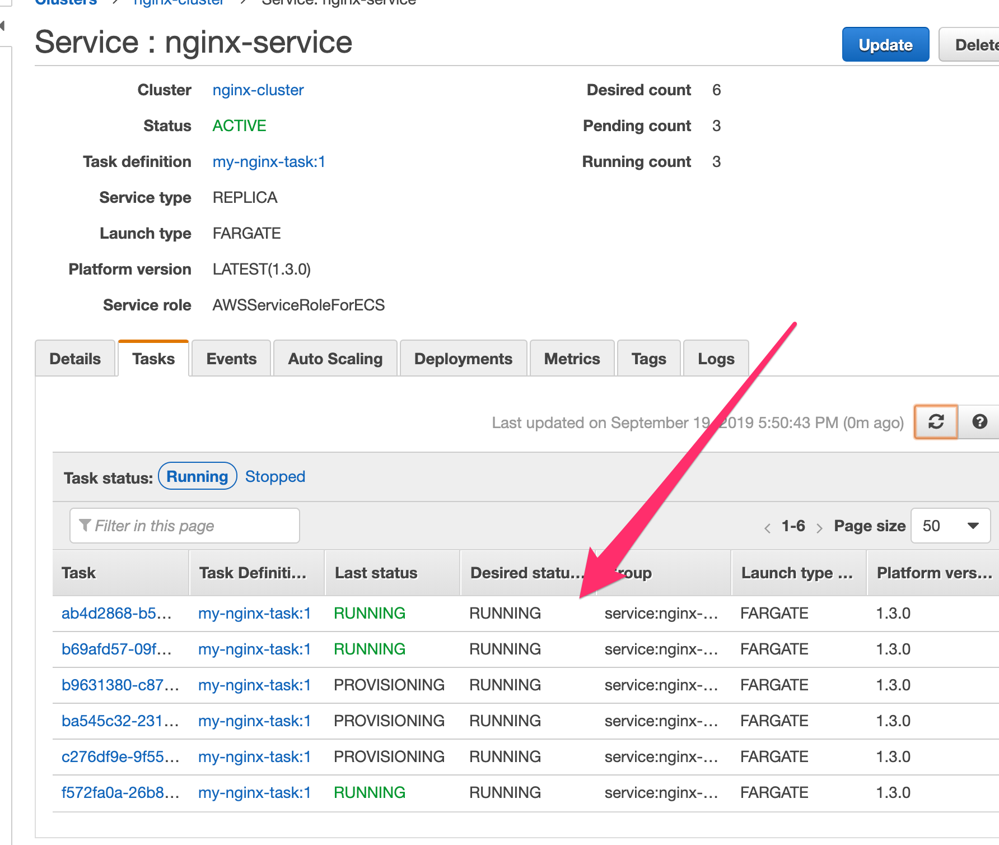

# Increase tasks

We will now increase manually the amount of desired tasks of this particular nginx service.

## 1. Get to the service

* Once inside the cluster in the bottom tabs, click the ``Services`` tab and hit the ``nginx-service`` service.

As you can observe in the ``Tasks`` tab, we currently have 3 tasks only. We will increase this to 6 by pressing ``Update`` on the top right corner. 

* Change the value of **Number of tasks** to ``6`` and press ``Next step`` going thru a couple of screens until you reach the ``Update service`` button. Go ahead and press it.
  

Go back to the services and to the ``Tasks`` tabs. Now you should see ECS provisioning a total of 6 tasks for your nginx container.

