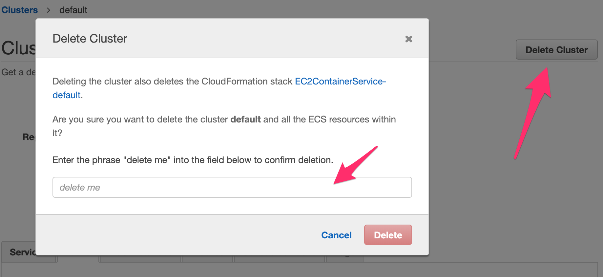

# Delete the cluster

> [!TIP]
> Deleting the cluster will vaporize all tasks and services running on it

## 1. Go to your clusters

* Go back to your list of clusters in ECS depending the region you chose before. Virginia or Ireland.

<!-- tabs:start -->
#### ** Virginia **
https://us-east-1.console.aws.amazon.com/ecs/home?region=us-east-1#/clusters
#### ** Ireland **
https://eu-west-1.console.aws.amazon.com/ecs/home?region=eu-west-1#/clusters
<!-- tabs:end -->

* Click on your ``nginx-cluster`` just created
* On the top right corner click ``Delete Cluster``
* On the dialog enter the ``delete me`` and press ``Delete``
  
